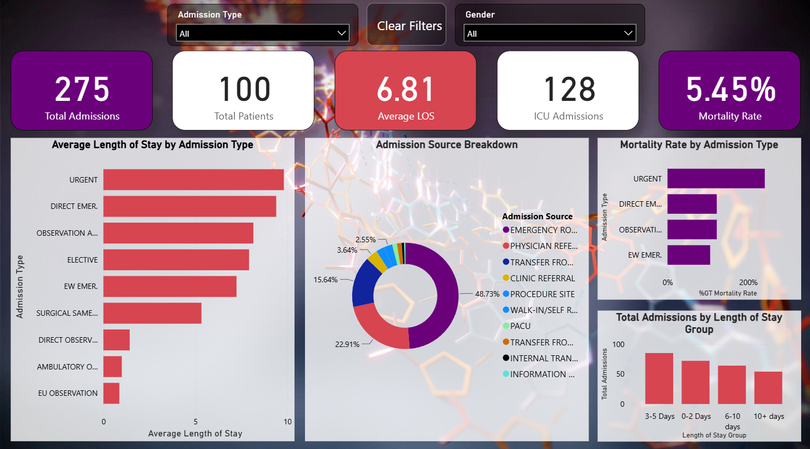

# HealthOps Intelligence Platform
*This project demonstrates data modeling, ETL with Power Query, DAX, and interactive dashboard development in Power BI.*

## Dashboard

## Overview

HealthOps Intelligence Platform is an interactive healthcare analytics dashboard built using the MIMIC-IV Demo dataset. It designed to help hospital administrators and operations teams improve decision-making through data-driven insights.

The project provides hospital administrators with insights into admissions, patient flow, length of stay, ICU utilization, mortality, and clinical operations.

## Features

- KPI cards
- Admission source and admission type analysis
- Length of Stay (LOS) analysis
- ICU admission and mortality metrics
- Interactive slicers and cross-filtering
- Drill-through enabled reporting

## Project Goals

- Analyze hospital operational performance
- Predict patient readmissions
- Forecast hospital capacity and bed occupancy
- Optimize staffing using mathematical optimization
- Build executive dashboards in Power BI
- Demonstrate an end-to-end analytics architecture using modern data technologies

## Technology Stack

- Microsoft Power BI
- Power Query
- DAX
- Git & GitHub

## Dashboard Screenshot

## Download Power BI Report

Download the Power BI report here:

[Hospital Operational Intelligence Platform.pbix](Dashboard/Hospital Operational Intelligence Platform.pbix)

## Dataset

The dashboard is built using the **MIMIC-IV Demo Dataset** from PhysioNet.

- Sample dataset included in the `Dataset` folder
- Original dataset: [https://physionet.org/content/mimic-iv-demo/2.2/](https://physionet.org/content/mimic-iv-demo/2.2/)

> 🚧 This project is currently under active development.
